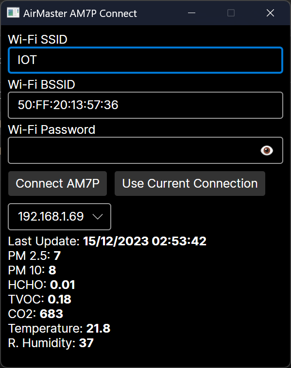

# Air Master AM7P Connect
 
AirMaster AM7 - dust, CO2, VOC, formaldehyde sensor. 
In [datasheet](http://www.datasheet.hk/download.php?id=2204315&pdfid=22A36C48510E7FD45F3AAA17A9B36A82&file=0603\airmaster_9117529.pdf) it says that Wi-Fi connection is only available for China. But that's not really true. 

The data transfer for connecting to the hotspot is done via AirKiss protocol, and this graphic application allows you to transfer this data.

## How to connect AM7P to Wi-Fi



The AM7 can only connect to 2.4Ghz, and it's best to disable the 5Ghz network altogether during the connection process.

Procedure:
1. Fill in the Wi-Fi network data in the program;
2. Press **Connect AM7P**;
3. Press and hold the Wi-Fi button (on the right side of the AM7P, next to the battery) for a couple of seconds,
4. Wait for the device you found to appear in the list

When the connection is made, the Wi-Fi icon on the Air Master screen lights up yellow (the manual says it is white). 

The program transmits data for a minute while the running bar is shown. After the time expires the data sending should be restarted.

By pressing the **Listen for data** button you can view the received data from the connected sensors. This mode also works immediately after startup.


## Home Assistant Integration

Once connected to Wi-Fi, you can add sensors to Home Assistant. In the path `home-assistant/am7p_receive.py` there is a script to receive sensor data and send it via MQTT to Home Assistant. The MQTT settings, and the names for the sensor by IP are in the script itself, at the beginning.

The script can be loaded into Home Assistant via the File editor addon. Add the service calling it in `configuration.yaml`:
```yaml
shell_command:
  listen_am7p: 'python /config/python_scripts/am7p_receive.py &'
```
After changing the configuration, you need to restart Home Assistant.
In automations, you can add a call to this service after startup.